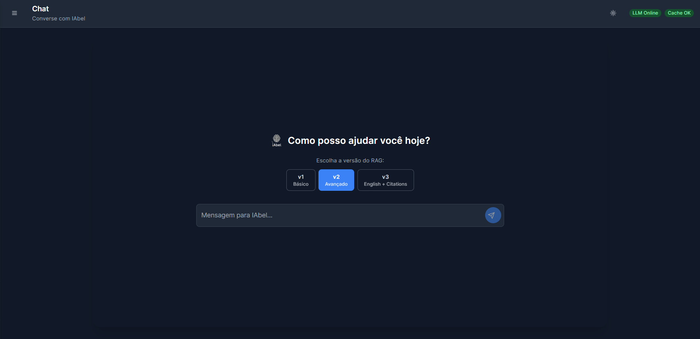
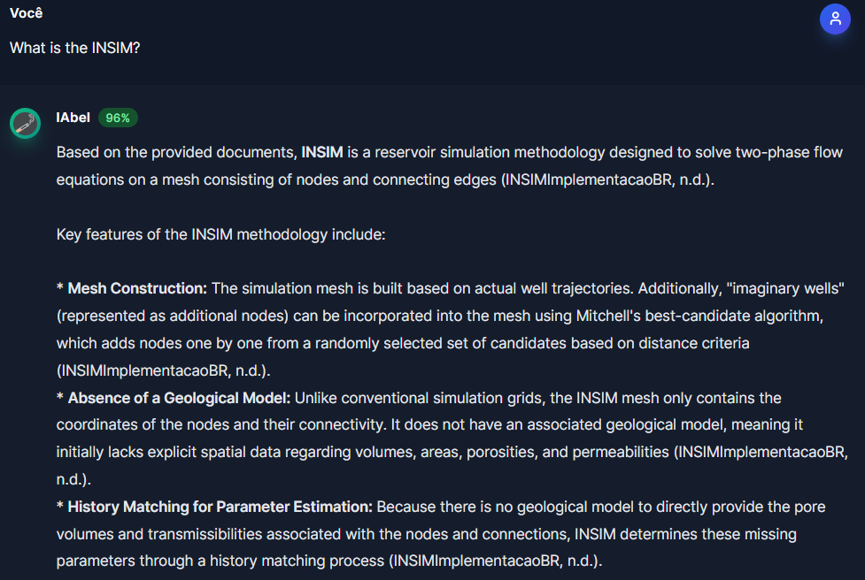
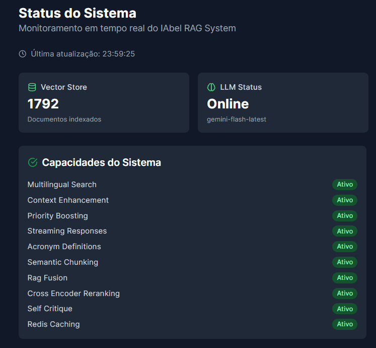

<div align="center">
  

  # IAbel — AI Agent for Reservoir Engineering

  **A multilingual RAG system specialized in petroleum reservoir engineering, with a primary focus on Brazilian Portuguese technical documentation.**

  [](https://python.org)
  [](https://fastapi.tiangolo.com)
  [](https://reactjs.org)
  [](https://typescriptlang.org)
  [](https://www.trychroma.com)
  [](LICENSE)

</div>

---

## About

**IAbel** is an AI-powered assistant for petroleum reservoir engineering. It uses a **Retrieval-Augmented Generation (RAG)** pipeline to answer technical questions grounded in domain-specific documents — simulation manuals, academic papers, and dissertations.

The system is **multilingual by design**, using the `paraphrase-multilingual-mpnet-base-v2` embedding model (50+ languages), and is optimized for **Brazilian Portuguese** technical terminology — including specialized acronyms such as INSIM, BHP, PVT, EOR, WAG, and CRM. It also supports English queries natively through its v3 mode with academic citation formatting.

All processing runs **fully locally** — no documents leave your machine.

---

## Screenshots

### Welcome Screen

ChatGPT-style interface with real-time status indicators and RAG version selector.



### Chat with Citations

Response with **96% confidence score**, context extracted from indexed documents and automatic academic references.



### System Status Dashboard

**1,792 documents indexed** · LLM Online (Gemini Flash) · 10 capabilities active simultaneously.



---

## Features

| Feature | Description |
|---|---|
| **Multilingual RAG** | Queries in Portuguese and English — simultaneously processed |
| **3 RAG Modes** | v1 Basic · v2 Advanced with RAG Fusion · v3 English + Academic Citations |
| **Real-time Streaming** | Token-by-token responses via WebSocket |
| **PDF Upload** | Add new documents and they are indexed automatically |
| **Academic Citations** | v3 mode tracks and formats consulted sources |
| **Conversation Memory** | Session history is maintained for continuous context |
| **LoRA Fine-tuning** | Pipeline to fine-tune the LLM on domain-specific data |
| **Monitoring Dashboard** | Real-time view of LLM, vectorstore, cache and errors |
| **Priority Boosting** | Abstracts (+40%), definitions (+50%), equations (+20%) ranked higher |
| **Context Compression** | Reduces retrieved context while preserving relevance (target ratio: 0.8) |

---

## Architecture

```
┌─────────────────────────────────────────────────┐
│           Frontend  (React + TypeScript)         │
│  Chat Interface · PDF Upload · System Status     │
│  WebSocket streaming · RAG v1 / v2 / v3          │
└─────────────────────┬───────────────────────────┘
                      │ HTTP / WebSocket
┌─────────────────────▼───────────────────────────┐
│              Backend  (FastAPI)                  │
│                                                  │
│  ┌─────────────────────────────────────────┐    │
│  │            RAG Pipeline                 │    │
│  │  1. Multi-query expansion (5 variants)  │    │
│  │  2. Vector search (ChromaDB)            │    │
│  │  3. RAG Fusion + cross-encoder rerank   │    │
│  │  4. Context compression                 │    │
│  │  5. Generation (Gemini / Ollama)        │    │
│  │  6. Citation tracking                   │    │
│  └─────────────────────────────────────────┘    │
└────────┬────────────────────────┬───────────────┘
         │                        │
┌────────▼──────────┐   ┌─────────▼──────────────┐
│  ChromaDB         │   │  Google Gemini / Ollama  │
│  768D Embeddings  │   │  LLM for generation      │
│  HNSW indexing    │   │                          │
└───────────────────┘   └─────────────────────────┘
         │
┌────────▼──────────┐
│  Redis Cache      │
│  TTL + embeddings │
└───────────────────┘
```

---

## Tech Stack

### Backend
- **[FastAPI](https://fastapi.tiangolo.com)** — REST API + WebSocket
- **[ChromaDB](https://www.trychroma.com)** — vector store with HNSW indexing
- **[Sentence Transformers](https://www.sbert.net)** — multilingual 768D embeddings (`paraphrase-multilingual-mpnet-base-v2`)
- **[Google Gemini](https://ai.google.dev)** — primary LLM (or Ollama for fully offline use)
- **[Redis](https://redis.io)** — multi-layer caching
- **[LangChain](https://langchain.com)** — document processing pipeline
- **[PEFT / LoRA](https://huggingface.co/docs/peft)** — parameter-efficient LLM fine-tuning

### Frontend
- **[React 18](https://react.dev)** + **[TypeScript](https://typescriptlang.org)**
- **[Vite](https://vitejs.dev)** — build tool
- **[TailwindCSS](https://tailwindcss.com)** — styling
- **[Framer Motion](https://www.framer.motion.com)** — animations
- **[Zustand](https://zustand-demo.pmnd.rs)** — state management
- **[Axios](https://axios-http.com)** — HTTP client

---

## Requirements

| Requirement | Minimum version |
|---|---|
| Python | 3.12+ |
| Node.js | 18+ |
| Redis | 7+ (optional — falls back to in-memory cache) |
| Google Gemini API Key | — |

**Hardware:**
- RAM: 4 GB minimum (8 GB recommended)
- Disk: ~3 GB for embedding models
- GPU: optional (accelerates embedding generation)

---

## Installation

### 1. Clone the repository

```bash
git clone https://github.com/lunatila/IAbel.git
cd IAbel
```

### 2. Configure environment variables

```bash
cp backend/.env.example backend/.env
```

Edit `backend/.env` and add your API key:

```env
LLM_PROVIDER=gemini
GOOGLE_API_KEY=your_key_here
GEMINI_MODEL=gemini-flash-latest
```

### 3. Backend (Python)

```bash
cd backend
python3 -m venv venv
source venv/bin/activate        # Linux/macOS
# or: venv\Scripts\activate     # Windows

pip install -r requirements.txt
```

### 4. Frontend (Node.js)

```bash
cd frontend
npm install
```

---

## Running

### Linux / macOS / WSL

**Terminal 1 — Backend:**
```bash
cd backend
source venv/bin/activate
python app/main.py
```

**Terminal 2 — Frontend:**
```bash
cd frontend
npm run dev
```

### Windows (native)

**Terminal 1 — Backend (via WSL):**
```bash
wsl bash -c "cd /path/to/IAbel/backend && python3.12 run_windows.py"
```

**Terminal 2 — Frontend:**
```powershell
cd frontend
npm run dev
```

### Access

| Service | URL |
|---|---|
| Frontend | http://localhost:3000 |
| Backend API | http://localhost:8000 |
| Swagger Docs | http://localhost:8000/docs |

> **Note:** On first startup, the embedding model (~430 MB) is loaded into memory. Expect a 1–5 minute initialization time.

---

## Adding Documents

Place your PDFs in `backend/data/pdfs/` and trigger reindexing:

```bash
curl -X POST http://localhost:8000/reindex/
```

Or use the upload interface at http://localhost:3000.

---

## RAG Modes

| Mode | Description | Best for |
|---|---|---|
| **v1** | Basic semantic search RAG | Simple, direct questions |
| **v2** | RAG Fusion + context compression + feedback learning | Complex queries in Portuguese |
| **v3** | English + formatted academic citations | Academic use with references |

---

## Project Structure

```
IAbel/
├── backend/
│   ├── app/
│   │   ├── main.py               # FastAPI server + endpoints
│   │   ├── services/
│   │   │   ├── rag_service.py    # RAG pipeline orchestrator
│   │   │   └── cache_service.py  # Redis cache service
│   │   └── utils/
│   │       └── logging_config.py
│   ├── fine_tuning/              # LoRA fine-tuning pipeline
│   ├── data/
│   │   └── pdfs/                 # Place your PDFs here
│   ├── requirements.txt
│   └── run_windows.py            # Windows startup script (WSL)
│
├── frontend/
│   └── src/
│       ├── components/
│       │   ├── chat/             # ChatInterface, ChatMessage, WelcomeScreen
│       │   ├── dashboard/        # SystemStatus
│       │   ├── upload/           # PDFUpload
│       │   └── ui/               # Base components
│       ├── services/api.ts       # API client
│       └── stores/appStore.ts    # Global state (Zustand)
│
├── local_rag/                    # Advanced RAG module
│   ├── embeddings/               # Local embedding models
│   ├── vectorstore/              # ChromaDB interface
│   ├── fusion/                   # RAG Fusion implementation
│   ├── citations/                # Citation tracking
│   ├── memory/                   # Conversation memory
│   └── models/                   # Gemini and Ollama clients
│
├── scripts/                      # Indexing and testing scripts
├── docker-compose.yml
└── README.md
```

---

## API Reference

### Main endpoints

```
POST /chat/             — Send message (standard RAG)
POST /chat/stream/      — Streaming response (SSE)
WS   /chat/stream       — WebSocket streaming
POST /upload-pdf/       — Upload new document
POST /reindex/          — Reindex all PDFs
GET  /status/           — System status
GET  /health/           — Health check
POST /feedback/         — Submit response feedback
```

Full interactive documentation at http://localhost:8000/docs

---

## LoRA Fine-tuning (optional)

The project includes a LoRA fine-tuning pipeline to adapt the LLM to reservoir engineering terminology:

```bash
cd backend/fine_tuning
python train_lora_light.py    # lightweight version — recommended to start
```

Trained models are saved to `backend/fine_tuning/outputs/`.

---

## Docker

```bash
docker compose up -d
```

Starts: backend, frontend, Redis, ChromaDB.

---

## Troubleshooting

**Backend takes long to start**
> Normal — embedding models (~430 MB) are loaded into memory on first run. Wait 1–5 minutes.

**`ModuleNotFoundError` on startup**
> Make sure the virtual environment is activated and run `pip install -r requirements.txt`.

**Frontend cannot connect to backend**
> Confirm the backend is running at http://localhost:8000 and check CORS settings in `backend/app/main.py`.

**Port 8000 already in use**
```bash
# Linux/macOS
lsof -ti:8000 | xargs kill -9

# Windows PowerShell
Get-Process -Id (Get-NetTCPConnection -LocalPort 8000).OwningProcess | Stop-Process
```

---

## Contributing

1. Fork the project
2. Create a branch: `git checkout -b feature/my-feature`
3. Commit: `git commit -m 'feat: add my feature'`
4. Push: `git push origin feature/my-feature`
5. Open a Pull Request

---

## License

Academic/educational use. Developed as part of doctoral research.

---

<div align="center">
  Built to help reservoir engineers navigate specialized technical documentation.<br/>
  
</div>
